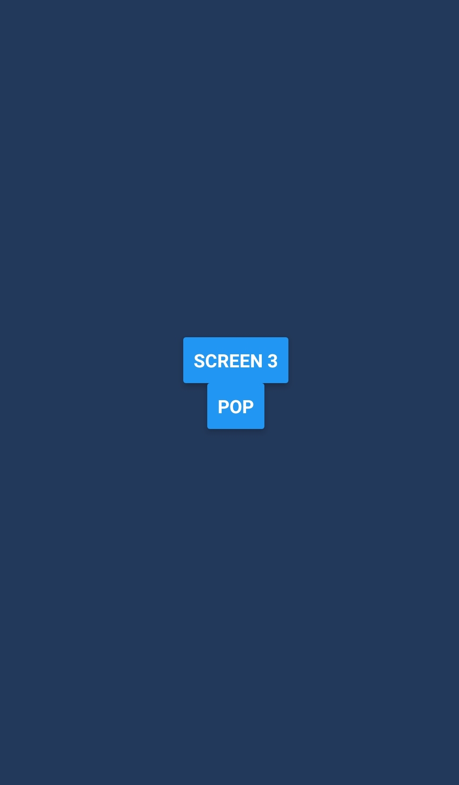

# RN-Navigator

A sample [React Native](https://facebook.github.io/react-native/) navigation library. This is used to demonstrate how actual React Native Navigation libraries are built

## Getting Started

The following instructions will get you set up and running.

### Pre-requisites

In order to have the project up and running, download the following onto your development machine

#### [Node](https://nodejs.org/en/) and [npm](https://www.npmjs.com) / [yarn](https://yarnpkg.com)

Ensure you have NodeJS installed on your development machine. Preferably Node version 9 and upper. While installing node, npm will be downloaded and installed as well.

#### Have a mobile device with you (iOS or Android) or even an emulator

Since this is primarily for React Native, you will need to have a mobile device for development. If you do not have either iOS or Android with you, ensure you can run on an emulator.

You can download and have emulators set up by following instructions outlined [here](https://developer.android.com/studio/run/emulator) for android and [here](https://docs.expo.io/versions/latest/introduction/installation#ios-simulator) for iOS. For the latter, ensure you are running on an Apple machine.

#### [Optional] Have an expo account

This is not necessary to have, but in the event you do want to make changes and publish it to expo. You will need to have an expo account set up. More information can be found [here](https://expo.io/)

## Screenshots

| Screen 1 | Screen 2 | Screen 3 |
| ---------| ---------|----------|
| | | |

## Deployment

Deployment can be either to App Store or Google Play Store. Since this is open-ended, the decision is up to you as to where to deploy the application. This can also be deployed to Expo. Instructions for this can be found [here](https://docs.expo.io/versions/v30.0.0/distribution/).

However, you can build an iOS IPK or Android APK using the `build:ios` and `build:android` scripts specified in the [package.json](./package.json) file.

## Built With

1. JavaScript - source language used
2. [React Native](https://facebook.github.io/react-native/) - Framework for building native apps
3. [Expo](https://expo.io) - Toolchain to help build Android and iOS apps with React

## License

This project is licensed under the MIT License - see the [LICENSE](./LICENSE) file for details.

